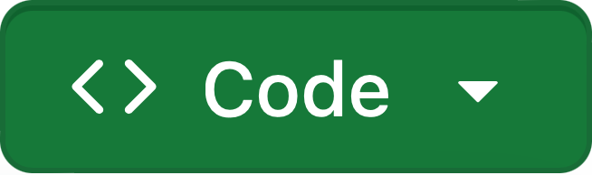
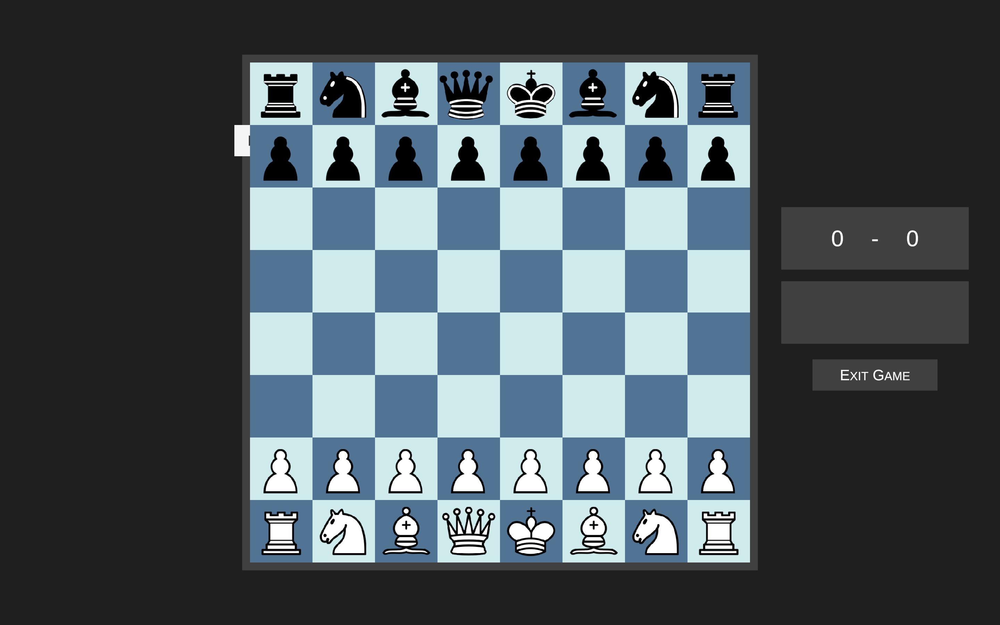

# Chess AI Game

### Chess AI — Created with Unity

##### Uses minimax algorithm to find best possible next move to a search depth of 3 moves.

*Must have Unity Game Engine installed on your computer. Instructions for installing Unity here:* [unity.com/download](https://unity.com/download)

To run the game in Unity:
1. Download the **Chess-AI-main.zip** by pressing the  button, then pressing **Download Zip**
2. Open Unity Hub and login to your account. 
3. Press **Add** in the top right corner, and navigate to the newly-downloaded **Chess-AI-main** folder.
4. Select your **Chess-AI-main** folder, and it will begin to download in your Unity account. 
5. Once dowloaded, the folder contents will appear in a list, including:
    >- **Animations**
    >- **Assets**
    >- **Scenes**
    >- **Scripts**
    >- **TextMesh Pro**

    Open the **Scenes** folder. 
6. Double-click the scene titled "**Main**" to view the game.
7. Click the play button at the top of the screen to run and play the game.

8. Play the game!
